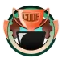
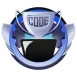

# ⚡ Avanade - Back-end com .NET e IA

Repositório dedicado às atividades, desafios e projetos desenvolvidos durante o bootcamp **Avanade - Back-end com .NET e IA** da [Digital Innovation One](https://www.dio.me/).

---

## 📌 Sobre o Bootcamp
O **Avanade - Back-end com .NET e IA** é um programa de capacitação que tem como foco o desenvolvimento back-end utilizando **.NET** e a integração de soluções com **Inteligência Artificial**, preparando profissionais para atuarem em projetos inovadores e de alto impacto no mercado de tecnologia.

## 🛠 Tecnologias e Ferramentas
Durante o bootcamp, foram utilizadas diversas tecnologias e conceitos, incluindo:
- C# e .NET
- ASP.NET Core
- Entity Framework
- SQL Server
- Princípios de API REST
- Git e GitHub
- Fundamentos de Inteligência Artificial

---

## 🏆 Certificados Conquistados (Clique e Acesse)

### 🧩 Princípios do Desenvolvimento de Aplicações
<table border="1">
  <thead>
    <tr>
      <th colspan="5">Certificados do Módulo</th>
    </tr>
  </thead>
  <tbody>
    <tr>
      <td></td>
      <td></td>
      <td></td>
      <td></td>
      <td></td>
    </tr>
  </tbody>
</table>

---

### ⚙️ Sintaxe Básica com .NET
<table border="1">
  <thead>
    <tr>
      <th colspan="5">Certificados do Módulo</th>
    </tr>
  </thead>
  <tbody>
    <tr>
      <td></td>
      <td></td>
      <td></td>
      <td></td>
      <td></td>
    </tr>
    <tr>
      <td></td>
      <td></td>
      <td></td>
      <td></td>
      <td></td>
    </tr>
  </tbody>
</table>

---

### 🧱 Programação Orientada a Objetos
<table border="1">
  <thead>
    <tr>
      <th colspan="5">Certificados do Módulo</th>
    </tr>
  </thead>
  <tbody>
    <tr>
      <td></td>
      <td></td>
      <td></td>
      <td></td>
      <td></td>
    </tr>
    <tr>
      <td></td>
      <td></td>
      <td></td>
      <td></td>
      <td></td>
    </tr>
    <tr>
      <td colspan="5" align="center">
        
      </td>
    </tr>
  </tbody>
</table>

---

## 📌 Atividades e Projetos
- **Módulo 1:** Princípios do Desenvolvimento de Aplicações 
- **Módulo 2:** Sintaxe Básica com .NET - [Desafio Estacionamento](https://github.com/alicessena/trilhaNetFundamentosDesafio)
- **Módulo 3:** Programação Orientada a Objetos - [Desafio Hospedagem](https://github.com/alicessena/TrilhaNetExplorandoDesafio) | [Desafio POO](https://github.com/alicessena/TrilhaNetPooDesafio)
- **Módulo 4:** Desenvolvimento de API
- **Módulo 5:** Integração com Banco de Dados
- **Módulo 6:** Introdução a Serviços de IA na Cloud com a Azure
- **Projeto Final:** Desafio Técnico Avanade

---

## 📜 Licença
Este projeto está sob a licença **MIT**.  
Sinta-se à vontade para utilizá-lo e adaptá-lo conforme necessário.

---

|  |
|:----------------------------------------------------------:|
| **Alice Sena** |
| **Desenvolvedora FullStack** |
