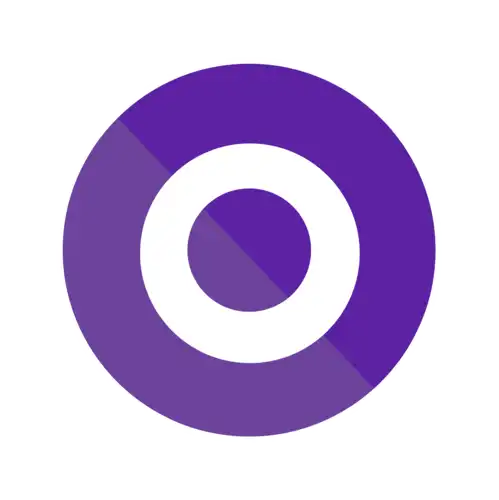

<div align="center">

# ⚡ Avanade - Back-end com .NET e IA

</div>

Repositório dedicado às atividades, desafios e projetos desenvolvidos durante o bootcamp **Avanade - Back-end com .NET e IA** da [Digital Innovation One](https://www.dio.me/).


## 📌 Sobre o Bootcamp
O **Avanade - Back-end com .NET e IA** é um programa de capacitação que tem como foco o desenvolvimento back-end utilizando **.NET** e a integração de soluções com **Inteligência Artificial**, preparando profissionais para atuarem em projetos inovadores e de alto impacto no mercado de tecnologia.

## 🛠 Tecnologias e Ferramentas
Durante o bootcamp, foram utilizadas diversas tecnologias e conceitos, incluindo:
- C# e .NET
- ASP.NET Core
- Entity Framework
- SQL Server
- Princípios de API REST
- Git e GitHub
- Fundamentos de Inteligência Artificial

## 🏆 Certificados Conquistados

<table border="1">
  <tr> <h3> Principios do Desenvolvimento de Aplicações </h3> </tr>
    <td>
        <a href="https://hermes.dio.me/certificates/BV0ONWBC.pdf"></a>
    </td>
    <td>
        <a href="https://hermes.dio.me/certificates/410FUWJI.pdf"></a>
    </td>
    <td>
        <a href="https://hermes.dio.me/certificates/U0XUNBCL.pdf"></a>
    </td>
    <td>
        <a href="https://hermes.dio.me/certificates/6XTBRBNU.pdf"></a>
    </td>
    <td>
        <a href="https://hermes.dio.me/certificates/OC0HGIJ5.pdf"></a>
    </td>  
  </tr>
</table>

<table border="1">
  <tr> <h3> Sintaxe Básica com .Net </h3> </tr>
    <td>
        <a href="#"></a>
    </td>
   
  </tr>
</table>

<!-- 
## 📂 Estrutura do Repositório
O repositório está organizado da seguinte maneira:
```
📁 avanade-backend-dotnet-ia
 ┣ 📂 modulo-1
 ┃ ┣ 📜 atividade1.md
 ┃ ┣ 📜 atividade2.md
 ┣ 📂 modulo-2
 ┃ ┣ 📜 desafio1.md
 ┃ ┣ 📜 desafio2.md
 ┣ 📂 projetos
 ┃ ┣ 📂 projeto-final
 ┃ ┃ ┣ 📜 README.md
 ┃ ┃ ┣ 📜 Program.cs
 ┃ ┃ ┣ 📜 Startup.cs
 ┃ ┃ ┣ 📜 Controllers
 ┃ ┃ ┣ 📜 Models
 ┃ ┃ ┣ 📜 Services
 ┗ 📜 README.md
``` -->

## 📌 Atividades e Projetos
- **Módulo 1:** Principios do Desenvolvimento de Aplicações 
- **Módulo 2:** Sintaxe Básica com .Net
- **Módulo 3:** Programação Orientada a Objetos
- **Módulo 4:** Desenvolvimento de API
- **Módulo 5:** Integração com Banco de Dados
- **Módulo 4:** Introdução a Serviços de IA na Cloud com a Azure
- **Projeto Final:** Desafio Técnico Avanade

## 📜 Licença
Este projeto está sob a licença MIT. Sinta-se à vontade para utilizá-lo e adaptá-lo conforme necessário.


|     |
|:----------------------------:|
|        **Alice Sena**        |
| **Desenvolvedora FullStack** |


